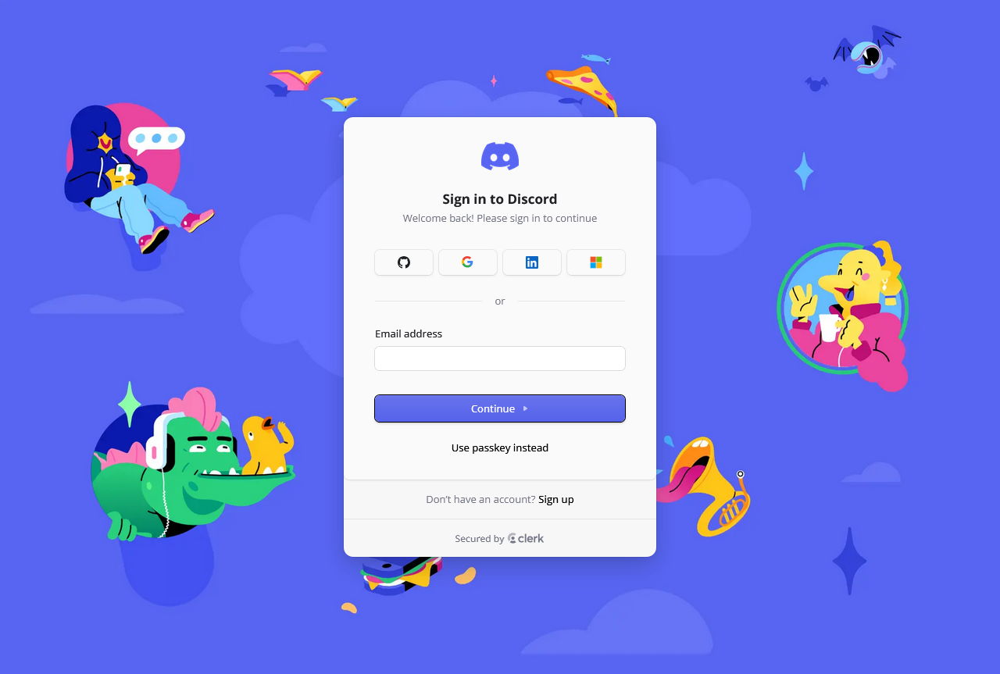
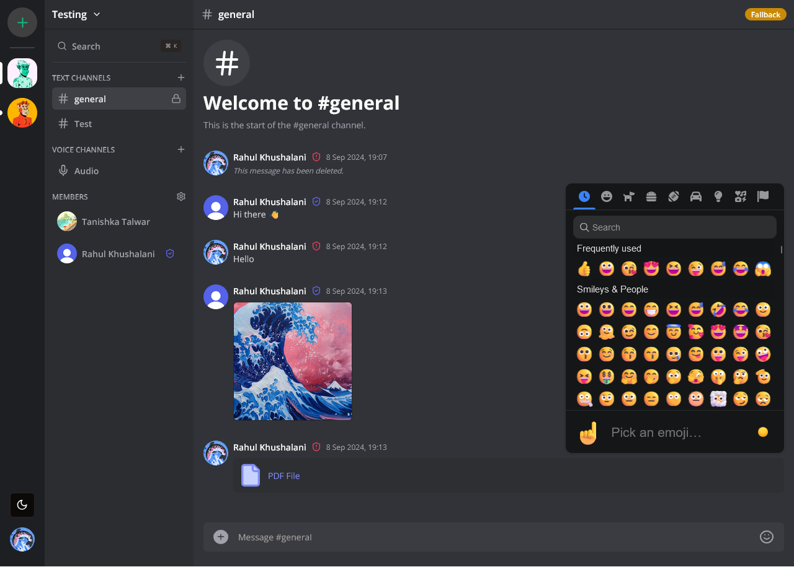
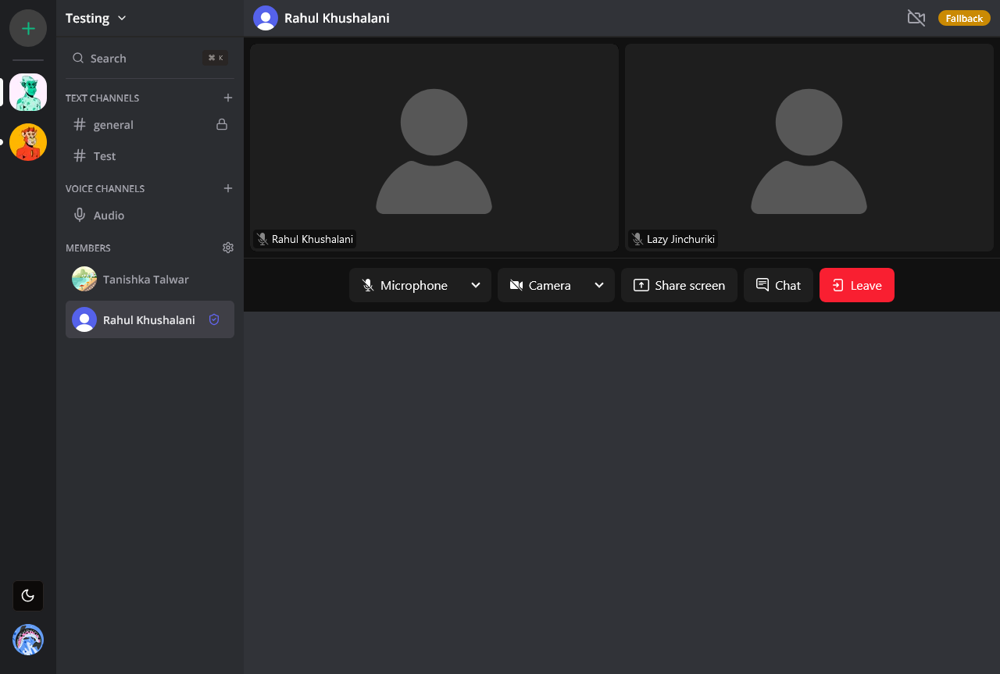

# Discord

A comprehensive Discord clone built with **Next.js**, providing real-time messaging, voice and video calls, and channel management. Built using modern web technologies, including **Tailwind CSS**, **Clerk** for authentication, **LiveKit** for voice/video, **Socket.io** for live messaging, and **Prisma** with **MongoDB** for robust data management.

## Tech Stacks

        

## Features

- **Real-Time Messaging**: Experience live messaging with **Socket.io** for low latency.
- **Voice and Video Calls**: High-quality voice and video calling powered by **LiveKit**.
- **User Authentication**: Secure user access with **Clerk**.
- **Channel Management**: Create, manage, and invite users to different channels.
- **Role-Based Access Control**: Assign roles and manage user permissions within channels.
- **Media Sharing**: Share images, files, and other media seamlessly within channels using **UploadThing**.
- **Customizable Channels**: Create channels with customizable properties for an enhanced experience.
- **Responsive Design**: The UI is fully responsive and works seamlessly across all devices.
- **Modern UI Components**: Built with **Tailwind CSS** and **ShadCN** for a modern, clean, and aesthetic user interface.
- **Database Management**: **MongoDB** with **Prisma ORM** for seamless database interactions and schema management.
- **Infinite Loading**: Efficiently load messages with infinite scrolling using **TanStack Query**.

## Screenshots





## Installation

1. **Clone the repository**:

   ```bash
   git clone https://github.com/lazyjinchuriki/discord.git
   cd discord
   ```

2. **Install dependencies**:

   ```bash
   npm install
   ```

3. **Set up environment variables**:

   Create a `.env` file in the root directory and add the following variables:

```env
NEXT_PUBLIC_CLERK_PUBLISHABLE_KEY=pk_test_your_clerk_publishable_key
CLERK_SECRET_KEY=sk_test_your_clerk_secret

NEXT_PUBLIC_CLERK_SIGN_IN_URL=/sign-in
NEXT_PUBLIC_CLERK_SIGN_UP_URL=/sign-up


DATABASE_URL="mongodb+srv://your-mongodb-url"
NODE_ENV=development

UPLOADTHING_SECRET=sk_live_your_uploadthing_secret

LIVEKIT_API_KEY=""
LIVEKIT_API_SECRET=""
NEXT_PUBLIC_LIVEKIT_URL=wss://your-livekit-url

NEXT_PUBLIC_SITE_URL=http://localhost:3000
```

4. **Set up Prisma and MongoDB**:

   Initialize Prisma and apply the schema to your MongoDB database:

   ```bash
   npx prisma init
   npx prisma db push
   ```

   This will generate the necessary Prisma client for interacting with MongoDB.

5. **Start the development server**:

   ```bash
   npm run dev
   ```

   Visit [http://localhost:3000](http://localhost:3000) in your browser to view the app.

## Usage

Once the server is running, you can access all features such as creating channels, managing users, conducting voice/video calls, and more.

## Customization

You can customize the app by editing the files in the `/app/` and `/components/` directories. Each feature is modular, making it easy to enhance or modify.

## Contributions

Contributions are welcome! Please create an issue or submit a pull request to help improve the project.

## Contact

If you have any questions or feedback, feel free to reach out at [rahulkhushalani@proton.me](mailto:rahulkhushalani@proton.me).

### Support

If you found this project helpful, consider supporting me:

<a href="https://www.buymeacoffee.com/lazyjinchuriki">
  
</a>

## Social

Follow me on my social channels for more updates:

[](https://www.instagram.com/amundaneguy/)
[](https://www.linkedin.com/in/rahul-khushalani-77ab21201/)

---
